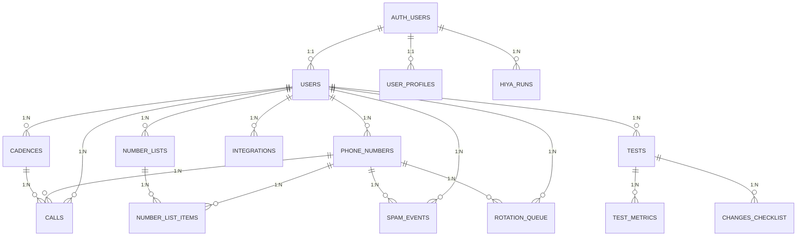

# 🗄️ Database Schema - Phone Guard

## 📋 Table of Contents

1. [Overview](#overview)
2. [Relationship Diagram](#relationship-diagram)
3. [Main Tables](#main-tables)
4. [System Tables](#system-tables)
5. [SQL Functions](#sql-functions)
6. [Triggers](#triggers)
7. [Indexes](#indexes)
8. [Row Level Security (RLS)](#row-level-security-rls)
9. [Migrations](#migrations)

---

## 🌐 Overview

The Phone Guard system uses **PostgreSQL** (Supabase) with the following features:

- **Row Level Security (RLS)**: All tables have security policies
- **UUID**: Unique identifiers for all entities
- **JSONB**: Flexible fields for metadata and configurations
- **Triggers**: Event automation (spam, reputation, etc.)
- **Functions**: Business logic in the database
- **Timestamps**: Complete audit with `created_at` and `updated_at`

### Statistics

- **Total tables**: 15+
- **Total functions**: 10+
- **Total triggers**: 5+
- **Total RLS policies**: 50+

---

## 🔗 Relationship Diagram



---

## 📊 Main Tables

### 1. **users** - System users
Synchronized with `auth.users` from Supabase

| Column | Type | Description |
|---------|------|-------------|
| `id` | UUID | PK, FK → `auth.users(id)` |
| `email` | TEXT | User email |
| `role` | TEXT | Role: `admin` \| `user` |
| `created_at` | TIMESTAMPTZ | Creation date |
| `updated_at` | TIMESTAMPTZ | Last update |

**Indexes**:
- `PK: id`
- `UNIQUE: email`

**RLS Policies**:
```sql
users_select_own: auth.uid() = id
users_insert_own: auth.uid() = id
users_update_own: auth.uid() = id
```

---

### 2. **user_profiles** - Extended user profiles

| Column | Type | Description |
|---------|------|-------------|
| `id` | UUID | PK |
| `user_id` | UUID | FK → `auth.users(id)` |
| `email` | TEXT | Email (unique) |
| `full_name` | TEXT | Full name |
| `role` | user_role | Enum: `admin` \| `manager` \| `user` |
| `is_active` | BOOLEAN | Is user active? |
| `created_at` | TIMESTAMPTZ | Creation date |
| `updated_at` | TIMESTAMPTZ | Last update |
| `created_by` | UUID | FK → `auth.users(id)` |

**Indexes**:
- `PK: id`
- `UNIQUE: user_id`
- `UNIQUE: email`

**Enum `user_role`**:
```sql
CREATE TYPE user_role AS ENUM ('admin', 'manager', 'user');
```

---

### 3. **phone_numbers** - Phone numbers with enrichment and tracking

| Column | Type | Description |
|---------|------|-------------|
| `id` | UUID | PK |
| `number` | TEXT | Phone number (unique, E.164) |
| `provider` | TEXT | Number provider |
| `status` | TEXT | `active` \| `inactive` \| `blocked` \| `spam` |
| `reputation_score` | INTEGER | 0-100, reputation score |
| `last_checked` | TIMESTAMPTZ | Last verification |
| `spam_reports` | INTEGER | Number of spam reports |
| `successful_calls` | INTEGER | Successful calls |
| `failed_calls` | INTEGER | Failed calls |
| `user_id` | UUID | FK → `users(id)` |
| `created_at` | TIMESTAMPTZ | Creation date |
| `updated_at` | TIMESTAMPTZ | Last update |
| **Enrichment** | | |
| `enrichment_data` | JSONB | Enrichment data (ChatGPT, etc.) |
| `last_reviewed` | TIMESTAMPTZ | Last manual review |
| **Hiya** | | |
| `hiya_label` | TEXT | Hiya label (e.g., "Spam Risk") |
| `hiya_score` | NUMERIC | Hiya score |
| `hiya_is_spam` | BOOLEAN | Marked as spam in Hiya? |
| `hiya_last_sync` | TIMESTAMPTZ | Last sync with Hiya |
| **SPAM Context** | | |
| `spam_reason` | TEXT | Reason marked as spam |
| `spam_detected_by` | TEXT | `api` \| `user` \| `automatic` |
| `spam_detected_at` | TIMESTAMPTZ | Detection date |
| `spam_context` | JSONB | Additional spam context |
| `spam_resolved_at` | TIMESTAMPTZ | Resolution date |
| `spam_resolution_reason` | TEXT | Resolution reason |
| **Rotation** | | |
| `rotation_protocol` | TEXT | `immediate` \| `scheduled` \| `manual` |
| `rotation_scheduled_at` | TIMESTAMPTZ | Scheduled rotation |
| `rotation_completed_at` | TIMESTAMPTZ | Completed rotation |

**Indexes**:
- `PK: id`
- `UNIQUE: number`
- `idx_phone_numbers_user_id ON (user_id)`
- `idx_phone_numbers_number ON (number)`
- `idx_phone_numbers_spam_status ON (status) WHERE status = 'spam'`
- `idx_phone_numbers_rotation_protocol ON (rotation_protocol)`

**RLS Policies**:
```sql
phone_numbers_select_own: auth.uid() = user_id
phone_numbers_insert_own: auth.uid() = user_id
phone_numbers_update_own: auth.uid() = user_id
phone_numbers_delete_own: auth.uid() = user_id
```

**Triggers**:
- `trigger_create_spam_event`: Creates event when spam detected
- `trigger_resolve_spam_event`: Creates event when spam resolved

---

### 4. **calls** - Call logs

| Column | Type | Description |
|---------|------|-------------|
| `id` | UUID | PK |
| `phone_number_id` | UUID | FK → `phone_numbers(id)` |
| `cadence_id` | UUID | FK → `cadences(id)` (nullable) |
| `destination_number` | TEXT | Destination number |
| `status` | TEXT | `success` \| `failed` \| `busy` \| `no_answer` \| `spam_detected` |
| `duration` | INTEGER | Duration in seconds |
| `cost` | DECIMAL(10,4) | Call cost |
| `call_time` | TIMESTAMPTZ | Call timestamp |
| `metadata` | JSONB | Additional data (recording, transcription, etc.) |
| `user_id` | UUID | FK → `users(id)` |

**Indexes**:
- `PK: id`
- `idx_calls_phone_number_id ON (phone_number_id)`
- `idx_calls_call_time ON (call_time DESC)`
- `idx_calls_user_id ON (user_id)`

**RLS Policies**:
```sql
calls_select_own: auth.uid() = user_id
calls_insert_own: auth.uid() = user_id
```

---

### 5. **cadences** - Cadences for A/B testing and rotation

| Column | Type | Description |
|---------|------|-------------|
| `id` | UUID | PK |
| `name` | TEXT | Cadence name |
| `description` | TEXT | Description |
| `phone_numbers` | UUID[] | Array of number IDs |
| `rotation_strategy` | TEXT | `round_robin` \| `random` \| `reputation_based` |
| `is_active` | BOOLEAN | Is cadence active? |
| `created_at` | TIMESTAMPTZ | Creation date |
| `updated_at` | TIMESTAMPTZ | Last update |
| `user_id` | UUID | FK → `users(id)` |

**Indexes**:
- `PK: id`
- `idx_cadences_user_id ON (user_id)`
- `idx_cadences_is_active ON (is_active)`

**RLS Policies**:
```sql
cadences_select_own: auth.uid() = user_id
cadences_insert_own: auth.uid() = user_id
cadences_update_own: auth.uid() = user_id
cadences_delete_own: auth.uid() = user_id
```

---

### 6. **number_lists** - Number lists (organizers)

| Column | Type | Description |
|---------|------|-------------|
| `id` | UUID | PK |
| `user_id` | UUID | FK → `auth.users(id)` |
| `name` | TEXT | List name |
| `description` | TEXT | Description |
| `color` | VARCHAR(7) | Hex color (e.g., #3B82F6) |
| `icon` | VARCHAR(50) | Icon name (e.g., Phone) |
| `is_default` | BOOLEAN | Is default list? |
| `created_at` | TIMESTAMPTZ | Creation date |
| `updated_at` | TIMESTAMPTZ | Last update |

**System Lists** (is_system = true, deprecated):
- "All Numbers" (all numbers)
- "Active" (active numbers)
- "Spam Detected" (spam numbers)
- "Action Needed" (require action)
- "Deleted" (deleted)

**Indexes**:
- `PK: id`
- `idx_number_lists_user_id ON (user_id)`
- `idx_number_lists_is_default ON (is_default)`

**RLS Policies**:
```sql
Users can view their own number lists
Users can insert their own number lists
Users can update their own number lists
Users can delete their own number lists
```

---

### 7. **number_list_items** - N:M relationship between lists and numbers

| Column | Type | Description |
|---------|------|-------------|
| `id` | UUID | PK |
| `list_id` | UUID | FK → `number_lists(id)` |
| `phone_number_id` | UUID | FK → `phone_numbers(id)` |
| `added_at` | TIMESTAMPTZ | Addition date |
| `added_by` | UUID | FK → `auth.users(id)` |
| `notes` | TEXT | Notes about inclusion |

**Constraint**:
- `UNIQUE(list_id, phone_number_id)`: A number can only be in a list once

**Indexes**:
- `PK: id`
- `idx_number_list_items_list_id ON (list_id)`
- `idx_number_list_items_phone_number_id ON (phone_number_id)`

---

## 🧪 CallOps Tracker (A/B Testing)

### 8. **tests** - A/B tests and experiments

| Column | Type | Description |
|---------|------|-------------|
| `id` | UUID | PK |
| `test_key` | TEXT | Unique key (e.g., T-003) |
| `code` | TEXT | Short code (e.g., FM) |
| `full_id` | TEXT | Complete ID (T-003-FM-2025-10-07) |
| `name` | TEXT | Test name |
| `alternative_name` | TEXT | Alternative name |
| `hypothesis` | TEXT | Experiment hypothesis |
| `objective` | TEXT | Objective |
| `design` | TEXT | Experiment design |
| `variants` | JSONB | Variants array: `[{"id":"A","label":"Mobile"},{"id":"B","label":"Fixed"}]` |
| `sample_per_variant` | JSONB | Sample per variant: `{"A": 100, "B": 100}` |
| `duration_hours` | INTEGER | Duration in hours |
| `status` | TEXT | `Pending` \| `Running` \| `ToReport` \| `Finished` \| `Canceled` |
| `owner_user_id` | UUID | FK → `auth.users(id)` |
| `parent_test_key` | TEXT | For iterations |
| `iteration_index` | INTEGER | 0 = base test, 1+ = iterations |
| `success_criteria` | TEXT | Success criteria |
| `created_at` | TIMESTAMPTZ | Creation date |
| `started_at` | TIMESTAMPTZ | Actual start date |
| `ended_at` | TIMESTAMPTZ | End date |

**Indexes**:
- `PK: id`
- `UNIQUE: test_key`
- `UNIQUE: full_id`
- `idx_tests_status ON (status)`
- `idx_tests_owner ON (owner_user_id)`

---

### 9. **test_metrics** - Test metrics

| Column | Type | Description |
|---------|------|-------------|
| `id` | UUID | PK |
| `test_id` | UUID | FK → `tests(id)` |
| `variant_id` | TEXT | Variant ID (A, B, C, etc.) |
| `metric_name` | TEXT | Metric name (conversion_rate, avg_duration, etc.) |
| `value` | NUMERIC | Metric value |
| `sample_size` | INTEGER | Sample size |
| `metadata` | JSONB | Additional data |
| `recorded_at` | TIMESTAMPTZ | Record timestamp |
| `recorded_by` | UUID | FK → `auth.users(id)` |

**Common Metrics**:
- `conversion_rate`: Conversion rate
- `avg_duration`: Average duration
- `response_rate`: Response rate
- `cost_per_conversion`: Cost per conversion

---

## 📈 Hiya Scraping

### 10. **hiya_numbers** - Scraped Hiya data

| Column | Type | Description |
|---------|------|-------------|
| `phone` | TEXT | PK, phone number (E.164) |
| `is_spam` | BOOLEAN | Detected as spam? |
| `label` | TEXT | Hiya label (e.g., "Spam Risk", "Clean") |
| `score` | NUMERIC | Reputation score |
| `last_seen` | TIMESTAMPTZ | Last seen in Hiya |
| `checked_at` | TIMESTAMPTZ | Last scraped |
| `raw` | JSONB | Complete scraping data |
| `created_at` | TIMESTAMPTZ | First scraped |
| `updated_at` | TIMESTAMPTZ | Last update |

**Indexes**:
- `PK: phone`
- `idx_hiya_numbers_is_spam ON (is_spam)`
- `idx_hiya_numbers_checked_at ON (checked_at DESC)`

**SPAM Detection**:
```sql
-- Keywords that mark is_spam = true:
spam, scam, fraud, robocall, telemarketer, 
suspicious, blocked, reported
```

---

### 11. **hiya_runs** - Scraping execution log

| Column | Type | Description |
|---------|------|-------------|
| `id` | BIGSERIAL | PK |
| `user_id` | UUID | FK → `auth.users(id)` |
| `rows_scraped` | INTEGER | Rows extracted |
| `rows_inserted` | INTEGER | Rows inserted in DB |
| `rows_updated` | INTEGER | Rows updated |
| `success` | BOOLEAN | Successful execution? |
| `error_message` | TEXT | Error message (if failed) |
| `duration_seconds` | INTEGER | Duration in seconds |
| `started_at` | TIMESTAMPTZ | Execution start |
| `ended_at` | TIMESTAMPTZ | Execution end |
| `preview_mode` | BOOLEAN | Preview mode? (doesn't write to DB) |

**Indexes**:
- `PK: id`
- `idx_hiya_runs_user_id ON (user_id)`
- `idx_hiya_runs_started_at ON (started_at DESC)`

---

## ⚙️ SQL Functions

### 1. **handle_new_user()**
Creates user profile on signup

```sql
CREATE OR REPLACE FUNCTION public.handle_new_user()
RETURNS TRIGGER AS $$
BEGIN
  INSERT INTO public.users (id, email, role)
  VALUES (NEW.id, NEW.email, 'user')
  ON CONFLICT (id) DO NOTHING;
  RETURN NEW;
END;
$$ LANGUAGE plpgsql;
```

**Trigger**:
```sql
CREATE TRIGGER on_auth_user_created
  AFTER INSERT ON auth.users
  FOR EACH ROW
  EXECUTE FUNCTION public.handle_new_user();
```

---

### 2. **update_phone_reputation()**
Updates reputation based on call results

```sql
CREATE OR REPLACE FUNCTION public.update_phone_reputation(
  phone_id UUID,
  call_status TEXT,
  user_id_param UUID
) RETURNS VOID AS $$
-- Logic:
-- success: +1
-- failed: -2
-- spam_detected: -10
-- busy: 0
-- no_answer: -1
$$;
```

**Usage**:
```sql
SELECT update_phone_reputation(
  'phone-uuid', 
  'success', 
  'user-uuid'
);
```

---

### 3. **get_next_phone_number()**
Gets next number according to rotation strategy

```sql
CREATE OR REPLACE FUNCTION public.get_next_phone_number(
  cadence_id_param UUID,
  user_id_param UUID
) RETURNS UUID AS $$
-- Strategies:
-- round_robin: By usage order (last_checked)
-- random: Random
-- reputation_based: Highest reputation_score first
$$;
```

---

## 🔔 Triggers

### 1. **create_spam_event**
Automatically creates spam event

```sql
CREATE TRIGGER trigger_create_spam_event
  AFTER UPDATE ON public.phone_numbers
  FOR EACH ROW
  EXECUTE FUNCTION create_spam_event();
```

**Logic**:
- If `status` changes to `'spam'` → Inserts in `spam_events`
- If `rotation_protocol = 'immediate'` → Inserts in `rotation_queue`

---

### 2. **resolve_spam_event**
Marks spam as resolved

```sql
CREATE TRIGGER trigger_resolve_spam_event
  AFTER UPDATE ON public.phone_numbers
  FOR EACH ROW
  EXECUTE FUNCTION resolve_spam_event();
```

**Logic**:
- If `status` changes from `'spam'` to other → Creates `'resolved'` event
- Updates previous spam events with `resolved_at`

---

## 📇 Complete Indexes

### Critical Performance

```sql
-- Phone Numbers
CREATE INDEX idx_phone_numbers_user_id ON phone_numbers(user_id);
CREATE INDEX idx_phone_numbers_number ON phone_numbers(number);
CREATE INDEX idx_phone_numbers_spam_status ON phone_numbers(status) WHERE status = 'spam';

-- Calls
CREATE INDEX idx_calls_phone_number_id ON calls(phone_number_id);
CREATE INDEX idx_calls_call_time ON calls(call_time DESC);
CREATE INDEX idx_calls_user_id ON calls(user_id);

-- Hiya
CREATE INDEX idx_hiya_numbers_is_spam ON hiya_numbers(is_spam);
CREATE INDEX idx_hiya_numbers_checked_at ON hiya_numbers(checked_at DESC);

-- Tests
CREATE INDEX idx_tests_status ON tests(status);
CREATE INDEX idx_test_metrics_test_id ON test_metrics(test_id);

-- Lists
CREATE INDEX idx_number_list_items_list_id ON number_list_items(list_id);
CREATE INDEX idx_number_list_items_phone_number_id ON number_list_items(phone_number_id);
```

---

## 🔒 Row Level Security (RLS)

### Principles

1. **All tables have RLS enabled**
2. **Users only see their own data** (except admin)
3. **Policies per operation**: SELECT, INSERT, UPDATE, DELETE
4. **Auth based on** `auth.uid()` from Supabase

### Complete Example

```sql
-- Enable RLS
ALTER TABLE phone_numbers ENABLE ROW LEVEL SECURITY;

-- Policy for SELECT
CREATE POLICY "phone_numbers_select_own" 
  ON phone_numbers FOR SELECT 
  USING (auth.uid() = user_id);

-- Policy for INSERT
CREATE POLICY "phone_numbers_insert_own" 
  ON phone_numbers FOR INSERT 
  WITH CHECK (auth.uid() = user_id);

-- Policy for UPDATE
CREATE POLICY "phone_numbers_update_own" 
  ON phone_numbers FOR UPDATE 
  USING (auth.uid() = user_id);

-- Policy for DELETE
CREATE POLICY "phone_numbers_delete_own" 
  ON phone_numbers FOR DELETE 
  USING (auth.uid() = user_id);
```

---

## 🔄 Migrations

### Execution Order

1. **001_create_tables.sql** - Base tables
2. **002_create_functions.sql** - SQL functions
3. **003_seed_data.sql** - Initial data
4. **004_add_user_roles.sql** - Role system
5. **007_create_integrations.sql** - Integrations
6. **010_alter_phone_numbers_enrichment.sql** - Enrichment
7. **011_add_score_columns.sql** - Additional scores
8. **012_enable_realtime.sql** - Real-time
9. **015_add_spam_context.sql** - Spam context
10. **017_add_number_lists_clean.sql** - Number lists
11. **041_create_callops_tracker.sql** - CallOps
12. **044_create_hiya_scraping_tables.sql** - Hiya scraping
13. **045_add_hiya_columns_to_phone_numbers.sql** - Hiya columns

### How to Execute

**In Supabase**:
1. Dashboard → SQL Editor
2. New query
3. Copy script content
4. Run

---

## 📊 Useful Queries

### View all numbers from a user

```sql
SELECT * FROM phone_numbers 
WHERE user_id = 'user-uuid'
ORDER BY created_at DESC;
```

### Numbers with detected spam

```sql
SELECT pn.*, se.reason, se.detected_by
FROM phone_numbers pn
LEFT JOIN spam_events se ON pn.id = se.phone_number_id
WHERE pn.status = 'spam'
ORDER BY se.created_at DESC;
```

### Active tests with metrics

```sql
SELECT t.*, 
  json_agg(tm.*) as metrics
FROM tests t
LEFT JOIN test_metrics tm ON t.id = tm.test_id
WHERE t.status = 'Running'
GROUP BY t.id;
```

---

## 📚 References

- [Supabase Docs](https://supabase.com/docs)
- [PostgreSQL Docs](https://www.postgresql.org/docs/)
- [RLS Guide](https://supabase.com/docs/guides/auth/row-level-security)
- [JSONB Performance](https://www.postgresql.org/docs/current/datatype-json.html)

---

**Last update**: October 2025  
**Schema version**: 1.0  
**Maintainer**: [Your name]
