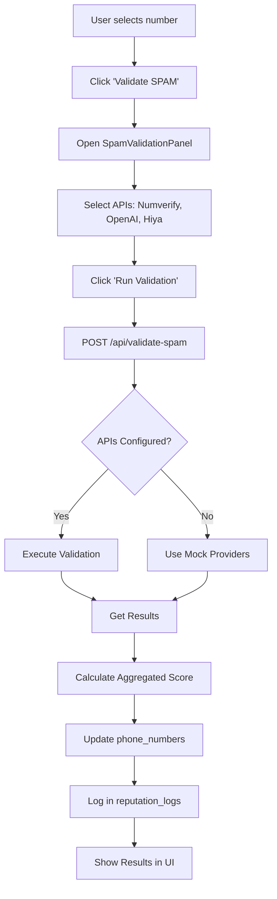
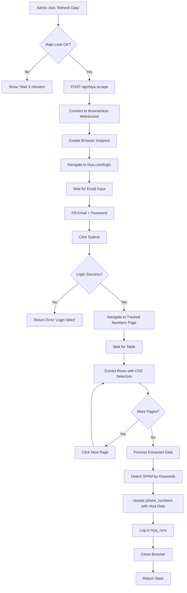

# 📦 Setup & Deployment Guide - Phone Guard

## 📋 Table of Contents

1. [Detailed Installation Guide](#detailed-installation-guide)
2. [Service Configuration](#service-configuration)
3. [Main Workflows](#main-workflows)
4. [External Integrations](#external-integrations)
5. [Deployment](#deployment)
6. [Troubleshooting](#troubleshooting)

---

## 🚀 Detailed Installation Guide

### Prerequisites

**Required Software**:
- Node.js 18+ ([Download](https://nodejs.org))
- pnpm 8+ (`npm install -g pnpm`)
- Git ([Download](https://git-scm.com))

**Required Accounts**:
- [Supabase](https://supabase.com) (database)
- [Vercel](https://vercel.com) (hosting)
- [Browserless.io](https://browserless.io) (Hiya scraping)
- [OpenAI](https://platform.openai.com) (ChatGPT - optional)
- Hiya account (for scraping)

---

### Step 1: Clone Repository

```bash
# Clone
git clone <repo-url>
cd phone-guard

# Install dependencies
pnpm install
```

**Main Dependencies**:
```json
{
  "next": "14.2.16",
  "@supabase/supabase-js": "latest",
  "puppeteer-core": "^24.23.0",
  "lucide-react": "^0.454.0",
  "tailwindcss": "^4.1.9"
}
```

---

### Step 2: Configure Supabase

#### a) Create Project

1. Go to [supabase.com/dashboard](https://supabase.com/dashboard)
2. Click "New Project"
3. Name: `phone-guard`
4. Password: [generate a secure one]
5. Region: Choose closest
6. Click "Create new project"

#### b) Copy Credentials

In Project Settings → API:

```bash
# Copy these values:
NEXT_PUBLIC_SUPABASE_URL=https://xxx.supabase.co
NEXT_PUBLIC_SUPABASE_ANON_KEY=eyJxxx...
SUPABASE_SERVICE_ROLE_KEY=eyJxxx...
```

**⚠️ Important**: 
- `SUPABASE_SERVICE_ROLE_KEY` for backend only
- Never commit to repository

---

#### c) Run Migrations

Go to Supabase → SQL Editor and execute scripts in order:

**1. Base Tables** (`scripts/001_create_tables.sql`):
```sql
-- Creates: users, phone_numbers, cadences, calls
```

**2. Functions** (`scripts/002_create_functions.sql`):
```sql
-- Creates: handle_new_user(), update_phone_reputation(), get_next_phone_number()
```

**3. Role System** (`scripts/004_add_user_roles.sql`):
```sql
-- Creates: user_profiles, admin_logs, system_settings
-- Adds user_role enum
```

**4. Integrations** (`scripts/007_create_integrations.sql`):
```sql
-- Creates: integrations table
```

**5. Enrichment** (`scripts/010_alter_phone_numbers_enrichment.sql`):
```sql
-- Adds: carrier, line_type, country_code, etc.
```

**6. Additional Scores** (`scripts/011_add_score_columns.sql`):
```sql
-- Adds: numverify_score, openai_score, average_reputation_score
```

**7. Real-time** (`scripts/012_enable_realtime.sql`):
```sql
-- Enables: Supabase Realtime on phone_numbers and calls
```

**8. SPAM Context** (`scripts/015_add_spam_context.sql`):
```sql
-- Creates: spam_events, rotation_queue
-- Adds: spam_reason, spam_detected_by, rotation_protocol
```

**9. Number Lists** (`scripts/017_add_number_lists_clean.sql`):
```sql
-- Creates: number_lists, number_list_items
```

**10. CallOps Tracker** (`scripts/041_create_callops_tracker.sql`):
```sql
-- Creates: tests, test_metrics, changes_checklist, audit_log
```

**11. Hiya Scraping** (`scripts/044_create_hiya_scraping_tables.sql`):
```sql
-- Creates: hiya_numbers, hiya_runs
```

**12. Hiya Columns** (`scripts/045_add_hiya_columns_to_phone_numbers.sql`):
```sql
-- Adds: hiya_label, hiya_score, hiya_is_spam to phone_numbers
```

**Verification**:
```sql
-- Verify tables were created
SELECT table_name 
FROM information_schema.tables 
WHERE table_schema = 'public'
ORDER BY table_name;

-- You should see ~15 tables
```

---

#### d) Create Admin User

```sql
-- Replace with your actual Supabase Auth email
DO $$
DECLARE
  admin_user_id UUID;
BEGIN
  -- Get user_id from email
  SELECT id INTO admin_user_id
  FROM auth.users
  WHERE email = 'your_email@example.com';
  
  -- Create admin profile
  INSERT INTO user_profiles (user_id, email, role, full_name)
  VALUES (admin_user_id, 'your_email@example.com', 'admin'::user_role, 'Admin User')
  ON CONFLICT (user_id) DO UPDATE
  SET role = 'admin'::user_role;
END $$;
```

---

### Step 3: Configure Environment Variables

#### a) Local Development

Create `.env.local` in root:

```bash
# Supabase
NEXT_PUBLIC_SUPABASE_URL=https://xxx.supabase.co
NEXT_PUBLIC_SUPABASE_ANON_KEY=eyJxxx...
SUPABASE_SERVICE_ROLE_KEY=eyJxxx...

# Browserless (for Hiya scraping)
BROWSERLESS_URL=wss://production-sfo.browserless.io?token=YOUR_TOKEN

# Hiya Credentials
HIYA_EMAIL=your_email@hiya.com
HIYA_PASSWORD=your_password

# Hiya URLs (optional, have defaults)
HIYA_LOGIN_URL=https://www.hiya.com/login
HIYA_TRACKED_URL=https://business.hiya.com/registration/cross-carrier-registration/phones

# Limits
MAX_PER_RUN=200
RATE_LIMIT_MINUTES=5

# OpenAI (optional, for ChatGPT SPAM validation)
OPENAI_API_KEY=sk-xxx

# Numverify (optional)
NUMVERIFY_API_KEY=xxx

# TrueCaller (future)
TRUECALLER_API_KEY=xxx
```

**⚠️ Security**:
```bash
# .gitignore should include:
.env.local
.env*.local
```

---

#### b) Production (Vercel)

1. Go to Vercel → Project → Settings → Environment Variables

2. Add **all** variables from `.env.local`

3. Select:
   - ✅ Production
   - ✅ Preview
   - ✅ Development

4. Click "Save"

---

### Step 4: Run in Development

```bash
# Start dev server
pnpm dev

# App will be at:
# http://localhost:3000
```

**First Run**:
1. Go to `/auth/login`
2. Login with your Supabase email
3. Should redirect to `/dashboard`
4. If admin, you'll see link to `/admin`

---

## ⚙️ Service Configuration

### Browserless (Hiya Scraping)

#### 1. Create Account

1. Go to [browserless.io](https://browserless.io)
2. Sign Up (Free plan: 6 hours/month)
3. Verify email

#### 2. Get Token

1. Dashboard → API Token
2. Copy token
3. **Important**: Use regional endpoint:
   - 🇺🇸 US West: `wss://production-sfo.browserless.io`
   - 🇬🇧 UK: `wss://production-lon.browserless.io`
   - 🇳🇱 Amsterdam: `wss://production-ams.browserless.io`

#### 3. Configure in Vercel

```bash
BROWSERLESS_URL=wss://production-sfo.browserless.io?token=YOUR_TOKEN_HERE
```

**⚠️ DO NOT USE**: `chrome.browserless.io` (obsolete, gives 403 error)

---

### OpenAI (ChatGPT)

#### 1. Get API Key

1. Go to [platform.openai.com/api-keys](https://platform.openai.com/api-keys)
2. Click "Create new secret key"
3. Copy and save the key

#### 2. Configure

```bash
OPENAI_API_KEY=sk-xxx
```

**Model Used**: `gpt-4` (configurable in code)

**Costs**:
- ~$0.03 per 1K input tokens
- ~$0.06 per 1K output tokens
- Estimated: $0.001 - $0.005 per validation

---

### Numverify

#### 1. Get API Key

1. Go to [apilayer.com/marketplace/numverify-api](https://apilayer.com/marketplace/numverify-api)
2. Sign Up (Free plan: 100 requests/month)
3. Dashboard → API Key

#### 2. Configure

```bash
NUMVERIFY_API_KEY=xxx
```

**Data Returned**:
- Number validity
- Carrier (operator)
- Line type (mobile, landline)
- Country, location

---

## 🔄 Main Workflows

### 1. SPAM Validation Flow

**Objective**: Validate a number with multiple providers



---

### 2. Hiya Scraping Flow

**Objective**: Extract reputation data from Hiya dashboard



---

### 3. Number Rotation Flow

**Objective**: Get next available number according to strategy

```mermaid
graph TD
    A[System needs number] --> B[POST /api/get-next-number]
    B --> C[Get Cadence]
    C --> D{Strategy?}
    D -->|round_robin| E[SELECT ... ORDER BY last_checked ASC]
    D -->|random| F[SELECT ... ORDER BY random()]
    D -->|reputation_based| G[SELECT ... ORDER BY reputation_score DESC]
    E --> H[Check Status]
    F --> H
    G --> H
    H --> I{Status = 'active'?}
    I -->|Yes| J[Return Number]
    I -->|No| K[Find Next]
    K --> H
    J --> L[UPDATE last_checked = NOW]
    L --> M[Increment usage]
    M --> N[End]
```

---

## 🔌 External Integrations

### 1. Supabase

**Purpose**: PostgreSQL database, Auth, Real-time

**Services Used**:
- ✅ PostgreSQL Database
- ✅ Supabase Auth (email/password, OAuth)
- ✅ Realtime (websockets)
- ❌ Storage (not currently used)
- ❌ Edge Functions (not used, we use Next.js API routes)

**Real-time Configuration**:
```sql
-- Enable realtime on tables
ALTER PUBLICATION supabase_realtime ADD TABLE phone_numbers;
ALTER PUBLICATION supabase_realtime ADD TABLE calls;
```

---

### 2. Browserless.io

**Purpose**: Cloud headless browser for web scraping

**Why Browserless**:
- ✅ No local Docker required
- ✅ No own server required
- ✅ Compatible with Vercel serverless
- ✅ WebSocket connection

**Alternatives** (not compatible with Vercel):
- ❌ Regular Puppeteer (requires local Chrome)
- ❌ Playwright (requires binaries)

**Usage in Code**:
```typescript
import puppeteer from 'puppeteer-core'

const browser = await puppeteer.connect({
  browserWSEndpoint: process.env.BROWSERLESS_URL
})

const page = await browser.newPage()
// ... scraping logic
await browser.close()
```

---

### 3. OpenAI (ChatGPT)

**Purpose**: Intelligent SPAM analysis with AI

**Model**: GPT-4 (configurable to GPT-3.5)

**Prompt Example**:
```typescript
const prompt = `
Analyze if this phone number is likely to be spam or legitimate:

Number: ${phoneNumber}
Country: ${country || 'Unknown'}
Provider: ${provider || 'Unknown'}
Historical data:
- Successful calls: ${successfulCalls}
- Failed calls: ${failedCalls}
- Spam reports: ${spamReports}

Respond in JSON format:
{
  "is_spam": boolean,
  "confidence": number (0-1),
  "category": "clean" | "spam" | "suspicious",
  "reason": "Brief explanation",
  "reputation": number (0-100)
}
`
```

---

## 🚀 Deployment

### Vercel (Recommended)

#### 1. Connect Repository

1. Go to [vercel.com/new](https://vercel.com/new)
2. Import your Git repository
3. Framework: **Next.js** (auto-detected)
4. Root Directory: `./` (root)
5. Build Command: `pnpm build` (auto)
6. Output Directory: `.next` (auto)

#### 2. Configure Variables

**In Vercel Dashboard**:
1. Settings → Environment Variables
2. Add all vars from `.env.local`
3. Select environments: Production + Preview + Development

**Critical Variables**:
```
NEXT_PUBLIC_SUPABASE_URL
NEXT_PUBLIC_SUPABASE_ANON_KEY
SUPABASE_SERVICE_ROLE_KEY
BROWSERLESS_URL
HIYA_EMAIL
HIYA_PASSWORD
```

#### 3. Deploy

**Automatic** (recommended):
```bash
git add .
git commit -m "Ready for production"
git push origin main
```

Vercel automatically deploys on each push to `main`.

---

### Local Build

```bash
# Production build
pnpm build

# Verify build
pnpm start

# Open: http://localhost:3000
```

---

## 🐛 Troubleshooting

### Problem 1: "Unauthorized" in all requests

**Cause**: Invalid session

**Solution**:
1. Clear browser cookies
2. Re-login at `/auth/login`
3. Verify that `NEXT_PUBLIC_SUPABASE_URL` and `NEXT_PUBLIC_SUPABASE_ANON_KEY` are correct

---

### Problem 2: Hiya scraping fails with "403 Forbidden"

**Cause**: Obsolete Browserless endpoint

**Solution**:
```bash
# ❌ DO NOT USE
BROWSERLESS_URL=wss://chrome.browserless.io?token=XXX

# ✅ USE
BROWSERLESS_URL=wss://production-sfo.browserless.io?token=XXX
```

---

### Problem 3: Real-time doesn't connect

**Cause**: Realtime not enabled on table

**Solution**:
```sql
-- In Supabase SQL Editor
ALTER PUBLICATION supabase_realtime ADD TABLE phone_numbers;
ALTER PUBLICATION supabase_realtime ADD TABLE calls;
```

---

### Problem 4: "Row not found" in queries

**Cause**: RLS blocking access

**Solution**:
```sql
-- Verify policies
SELECT * FROM pg_policies 
WHERE tablename = 'phone_numbers';

-- Debug (dev only): Temporarily disable RLS
ALTER TABLE phone_numbers DISABLE ROW LEVEL SECURITY;

-- Verify auth.uid()
SELECT auth.uid(); -- Should return your user_id
```

---

### Problem 5: Vercel timeout (10s)

**Cause**: Scraping or validation takes too long

**Solution**:
1. **Reduce MAX_PER_RUN** to 50-100
2. **Upgrade to Vercel Pro** (60s timeout)
3. **Use background jobs** (future): Vercel Cron or Queue

---

## 📚 Additional Resources

- [Next.js Docs](https://nextjs.org/docs)
- [Supabase Docs](https://supabase.com/docs)
- [Vercel Docs](https://vercel.com/docs)
- [Browserless Docs](https://www.browserless.io/docs)
- [OpenAI API Docs](https://platform.openai.com/docs)

---

**Last update**: October 2025  
**Version**: 1.0  
**Maintainer**: [Your name]

